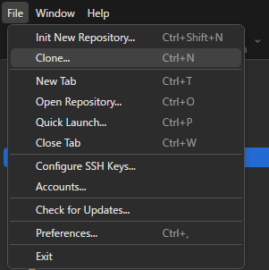
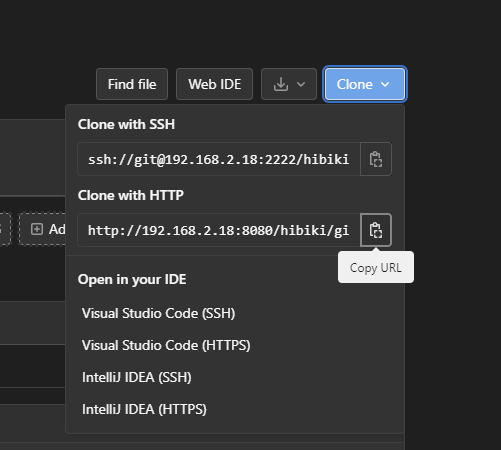
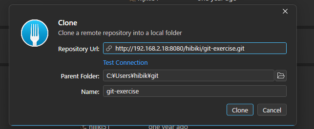
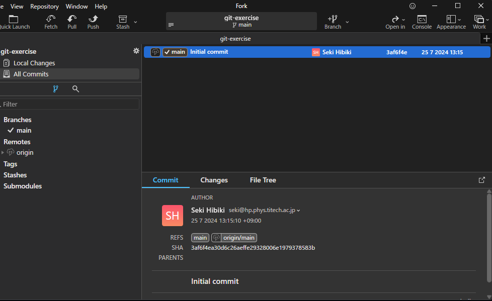

# Git レポジトリのクローン
先ほど作成したレポジトリを手元のPCにコピーします。


## Fork での操作

「File」→「Clone...」を選択します。



続いて、先ほど作成したプロジェクトのページを開き、画面中央右にある「Clone」をクリックします。
すると、次のようにURLが表示されるので、「Clone with HTTP」となっているほうのURLをコピーします。



コピーしたURLを Fork の入力欄に張り付け、保存場所を指定したのち、「Clone」を押します。




すると GitLab ユーザー名とパスワードを聞かれるので入力してください。
最終的にこのような画面になれば成功です。




:::tip
多くのGitホスティングサービスでは、HTTP(S)とSSHによるクローンをサポートしています。

**HTTP(S)によるクローン**

今回用いた方式で、認証（クローンしたユーザーが誰であるかの確認）には、Basic認証方式が用いられます。
Basic認証方式はユーザー名とパスワードを用いて認証を行う方式ですが、パスワードをサーバーに伝達する際、クリアテキスト（暗号化なし）で伝達されるため、**安全ではありません**。
それゆえ、HTTPS/TLSと併用することが基本となっています。  
なお、GitHub ではパスワードではなく、PAT(Personal Access Token)を用いる必要があります。

**SSHによるクローン**

SSH(**S**ecure **SH**ell)プロトコルを用いてクローンする手法です。公開鍵暗号が採用されることが多く、公開鍵を事前にGitホスティングサービスに登録し、秘密鍵を用いて認証・暗号化を行います。
Gitのシステムとして暗号手法に対する制約はありませんが、個人的には楕円曲線暗号(EDCSA, EdDSA)を用いることを推奨します。

作成例(EdDSA)：
```bash
ssh-keygen -t ed25519 
```


**参考文献**
- [Gitサーバー - プロトコル](https://git-scm.com/book/ja/v2/Git%E3%82%B5%E3%83%BC%E3%83%90%E3%83%BC-%E3%83%97%E3%83%AD%E3%83%88%E3%82%B3%E3%83%AB)  
- [Basic 認証方式](https://developer.mozilla.org/ja/docs/Web/HTTP/Authentication#basic_%E8%AA%8D%E8%A8%BC%E6%96%B9%E5%BC%8F)  
- [RFC7617: The 'Basic' HTTP Authentication Scheme](https://datatracker.ietf.org/doc/html/rfc7617)  

:::


## CLIでの操作

```bash
cd ~/path/to/workdir # ディレクトリは個人の環境に合わせて変えてください

git clone https://~~~.git
UserName: hijiki51
Password: *********
```

