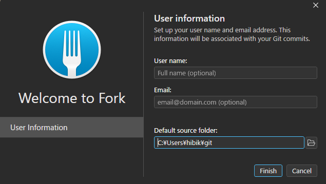

# Git クライアントのインストール

このページでは Git を操作するのに便利な GUI クライアントのインストールをします。

## 目次

[[toc]]

## Git クライアントとは
座学編で述べたような Commit, Push, Pull などの操作は、コマンドを打つことで行うことができます。
しかしながら、 Git をきちんと使うには、コミットの流れやブランチなどを意識することが必要であり、慣れるまでは少しハードルが高いかもしれません。

Git (GUI) クライアントは、このような Git の操作を GUI で行うことができるツールです。
Commit, Pull/Push のほか、ブランチの作成やマージ、コミットの履歴を視覚的に確認することができます。
有名なものとしては、
- [Fork](https://git-fork.com/)
- [GitHub Desktop](https://github.com/apps/desktop)
- [GitKraken](https://www.gitkraken.com/)
- [SourceTree](https://www.sourcetreeapp.com/)

などがあります。

今回の実習では Fork を使用します。

## Forkのインストール

インストールページから各自の OS に合わせてダウンロードし、インストールしてください。

https://git-fork.com/

::: info
Fork は Windows/Mac のみの対応で、Linux には対応していません。WSLなどの Linux 環境で操作したい場合はコマンドで操作するか、他の Git クライアントを使用してください。

本テキストでは Fork の操作と等価なコマンドも記載していますので、そちらを参照してください。
:::

## 初期設定

### Fork

インストールウィザードを起動すると次のような画面が出てきます。
個人の環境に合わせてすべての空欄を埋めてください。


- User Name: Commit に記録されるユーザ名（公開されます）
   - 本名である必要はないです（ハンドルネームにする人もいます）
- Email: Commit に記録されるメールアドレス（公開されます）
- Default Source Folder: 作業フォルダ（この下に保存されます）

なお、この設定は後から変更することもできます。




### CLI

ここでは Debian 系の Linux を例に説明します。他の環境を使っている人は読み替えてください。

#### Git のインストール

```bash
sudo apt install git
```


#### Git の初期設定

```bash
git config --global user.name "Your Name"
git config --global user.email "email@example.com"
```