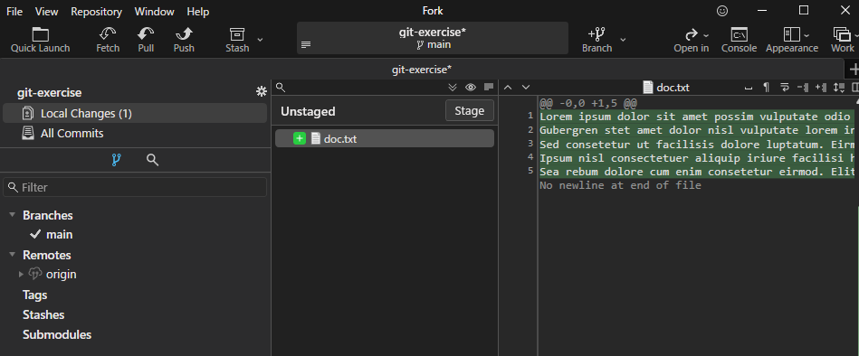

# Commit & Push

実際にレポジトリに変更を加え、コミット→プッシュしてみましょう。


## Commit

Fork の右上にある「Open in」から「Open in Visual Studio Code」を選ぶか、「Open in File Explorer」を選択することで、レポジトリを開くことができます。
:::info
本資料ではVSCodeを使って操作します。
:::

レポジトリを開いたら、適当なファイル名でファイルを作成し、適当な内容を書き込み、保存してください。


この状態で Fork を再度開き、左にある「Local Changes」をクリックします。
すると、変更した部分に色がついて表示されます。



実際にコミットをしていきます。まずはコミットに含めるファイルを選択します。今回は一つしかないので、「Stage」をクリックしてください。


:::info
Gitではコミットに含める変更と含めない変更を分けて扱うことができます。コミットにどの変更を含めるかという情報が保管されている領域を「ステージング・エリア」または「インデックス」と呼びます。

コミットを変更に含めたくなくなった場合は、「Unstage」をクリックすることでステージング・エリアから外すことができます。

コマンドの場合は
```bash
git reset HEAD {filename}
```

**参考文献**

[Gitの基本](https://git-scm.com/book/ja/v2/%E4%BD%BF%E3%81%84%E5%A7%8B%E3%82%81%E3%82%8B-Git%E3%81%AE%E5%9F%BA%E6%9C%AC)
:::

:::tip
ファイルの中の特定の行だけステージング・エリアに移動することもできます
:::


次にコミットメッセージを入力します。右下にある「Commit Subject」にコミットのタイトル（50 byte以内）を、その下の「Description」にコミットの詳細(72 byte以内 / line)を入力してください。
入力し終わったら、「Commit 1 File」をクリックすればコミット処理が終了します。


左のBranches → main を選択し、先ほどのコミットが反映されていることを確認しましょう。


## Push

次に、このコミットをリモートレポジトリに反映させます。左上の「Push」をクリックしてください。


すると、次のような画面が出てきます。今回は特に何も変更せずに「Push」をクリックしてください。


:::info
**各項目の説明**

- Branch
    - リモートレポジトリにプッシュするブランチを選択します。
- To
    - プッシュ先のブランチを選択します。通常ローカルレポジトリと同名のブランチを設定します。
- Push all tags
    - Gitにはコミットに別名としてタグをつけることができます。（v1.0.0など）これをリモートレポジトリにも反映するかどうかを選択します。
- Force push
    - **初心者は触るな危険**。リモートリポジトリのブランチをローカルのブランチに**完全に置き換えます**
    - 何らかの事情でコミット履歴がリモートと食い違った場合に実行します。
        - そのため、通常は必要ありません。
    - 理解せずに実行すると、コミット履歴が消える可能性があるので、理解してから実行してください。

:::

これでコミットがリモートレポジトリに反映されました。GitLab上で確認しましょう。
下図のように反映されていれば成功です。


