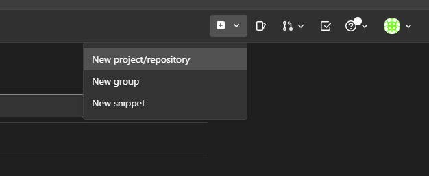
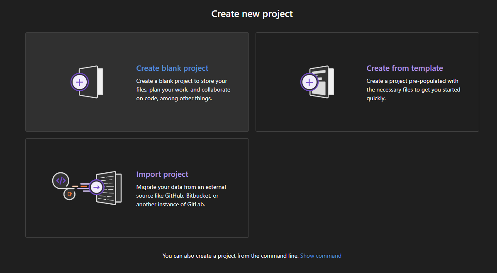
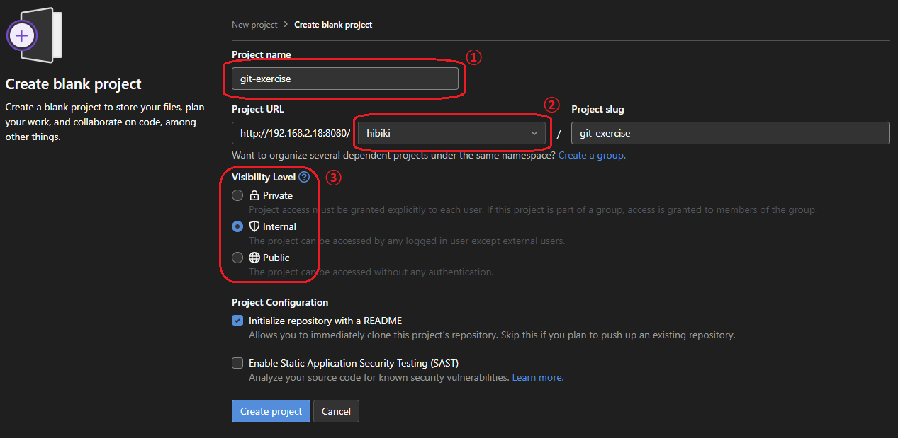
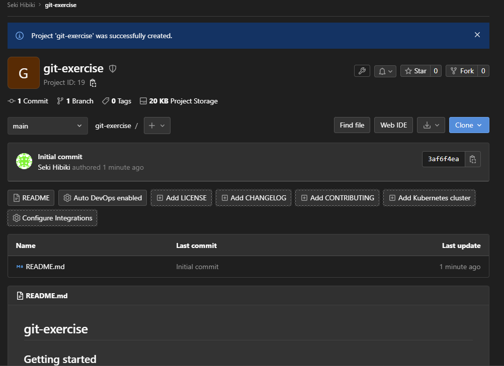

# Git レポジトリの作成

今回は GitLab を使用します。
:::info
GitLab では Repository のことを Project と呼ぶので注意してください。
:::

この実習では事前に GitLab アカウントが必要なので事前に準備しておいてください。

## Git レポジトリの作成

まず、GitLab にログインし、右上の「Create new...」から「New project/repository」を選択します。

すると次のような画面になるので、「Create Blank Project」を選択します

:::tip
「Create From Template」を選択すると、GitLab が用意している各言語/フレームワークの初期設定が構築されたテンプレートから作業を始めることができます。

:::

プロジェクト作成画面で以下の事項を入力します：
- ①：プロジェクト名（半角英数字と`-_`のみ）
- ②：プロジェクトを所有するユーザー・グループ
    - 今回は個人で作成するので、自分のユーザー名を選択してください
- ③：公開範囲
    - Private: **レポジトリの所有者**と**許可されたユーザー**のみがアクセス可能
    - Internal: GitLab に**ログインできるユーザー全員**が閲覧可能
    - Public: 誰でも閲覧可能
    - 今回は Internal で作成してください

以上の設定が終わったら、「Create Project」をクリックして先に進んでください。
次のような画面に遷移すれば完了です。

この画面はあとで使うので開いたままにしておいてください。

